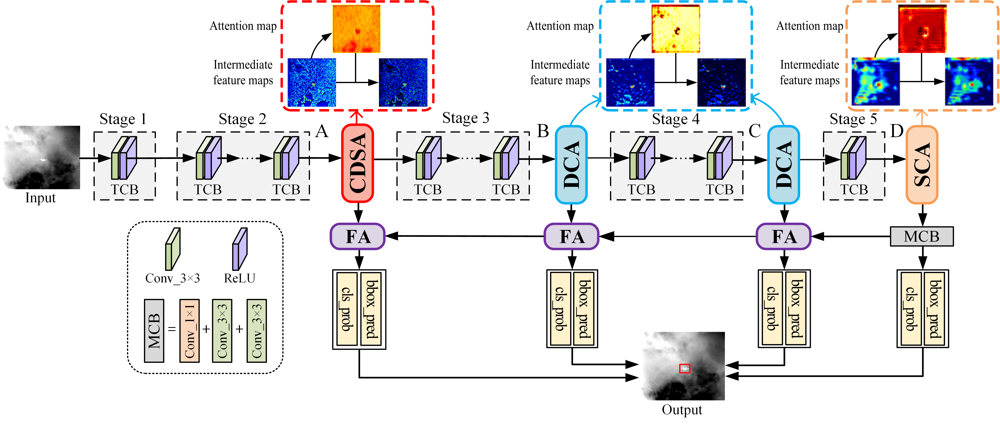

Source code for the TII 2023 paper "Differentiated Attention Guided Network Over Hierarchical and Aggregated Features for Intelligent UAV Surveillance".

## Differentiated Attention Guided Network Over Hierarchical and Aggregated Features for Intelligent UAV Surveillance [[PDF](https://ieeexplore.ieee.org/document/10018470/)], Supplemental Material [[PDF](https://ieeexplore.ieee.org/document/10018470/media#media)] 

## Network Architecture
<p align="center">
  
</p>
Overall architecture of the proposed DAGNet.

## Software installation

Basic environmental setups:

 - Python 3.9
 - CUDA 11.1
 - cuDNN 8.0.5

Python environmental setups:

 - lxml==4.6.3
 - matplotlib==3.4.1
 - mmcv==1.7.0
 - mmcv_full==1.6.0
 - numpy==1.20.1
 - opencv_python==4.5.4.60
 - torch==1.8.1+cu111
 - torchvision==0.9.1+cu111
 - tqdm==4.59.0

For Python environmental setups, run `pip install -r requirements.txt`. Note that the `mmcv` and some other packages have been updated, as well as the CUDA and cuDNN. If you run into some environmental problems, make sure the environment are correctly configured.

## Weight file

The pretrained backbone weight file for finetuning can be downloaded from <a href='https://drive.google.com/file/d/1GLfEk0E3_54hZLQOcdR03hrPhoYiT1jy/view?usp=sharing'>Google Drive</a> / <a href='https://pan.baidu.com/s/17KQYchw3rNS2Mn4Cv79hiw'>Baidu Drive</a> (passcode: 2pyz).

The testing weight file can be downloaded from <a href='https://drive.google.com/file/d/1hCjJDQncvuL3c5ca8r_KLqtcMDttLRdU/view?usp=sharing'>Google Drive</a> / <a href='https://pan.baidu.com/s/16bgVu4htvHTcYVbjp7JLag'>Baidu Drive</a> (passcode: code).

The weight file should be placed in the ***weights*** directory, and it should be created manually.

## Open-access datasets

In our paper we utilize two infrared image sequences that are online available, which can be downloaded from <a href="https://drive.google.com/drive/folders/1ps_LG9kKXgj4kQO4UhoD1R4Ru1AIS7Q0?usp=sharing">Google Drive</a> / <a href="https://pan.baidu.com/s/1oUb8zPDZbP7cE6Bm6U_Uig">BaiduYun</a> (password: code). The file name indicates its corresponding sequence number. We organize these sequences of images into two folders, which are JPEGImages (contains image files in BMP format) and Annotations (contains annotation files in XML format).

## Test images

The images for test purposes are given in the folder named `test_imgs`

## Training

In `train.py`, you need to determine the following key configurations:

- `dataset_root`: Where your `VOC2007` directory is. Give the full absolute path if necessary.
- `basenet`: The path to the pretrained backbone weight file. Should be placed in the `weights` directory.
- `batch_size`: Batch size for training. Could be any number that is a power of 2, based on GPU usage.
- `resume`: Whether to resume the training. If `True`, then the training code will **automatically** find the latest available intermediate weight file to resume.
- `cuda`: Whether to use GPU for training.
- `learning_rate`: Learning rate for training. Default is `1e-3`. Could smaller it if `NaN` occurs.
- `save_folder`: The directory to save all weight files during training.

There are two places you need to pay attention to:
- `data/config.py`: There's one dictionary variable called `voc_dagnet`, and the key `num_classes` controls the number of classes, while `lr_steps` controls when the learning rate drops according to the iterations.
- `data/voc0712.py`: The cuple variable `VOC_CLASSES` defines what class names are. If there's only one class to detect, **make sure you add a comma after the first string**.

Note that, if you run into some problems with multi-GPU training, it might probably caused by `torch.nn.DataParallel`. You can use `torch.distributed.launch` or `torch.distributed.run` instead and try.

## Testing

Simply run the following code in the console.
```Shell
python detect.py --weights ./weights/test.pth --image_dir ./test_imgs/ --output ./detection/ --cuda True
```
If you wanna run the script with CUDA device, set `--cuda True`, otherwise `--cuda False`.

By running the script, the detection results of the sample images will be saved in the `detection` directory that will appear after finishing running the script. In each detection result image, the red box indicates the detected UAV target.

## Citation
If you find our work useful for your research, please consider citing our paper:
```
@ARTICLE{2023TII_DAGNet,
  title     =  {Differentiated Attention Guided Network Over Hierarchical and Aggregated Features for Intelligent {UAV} Surveillance},
  author    =  {Houzhang Fang and Zikai Liao and Xuhua Wang and Yi Chang and Luxin Yan},
  journal   =  {IEEE Transactions on Industrial Informatics}, 
  year      =  {2023},
  volume    =  {19},
  number    =  {9},
  pages     =  {9909-9920},
}
```
In additoin to the above paper, please also consider citing the following references. Thank you!
```
@inproceedings{2025CVPR_UniCD,
    title     = {Detection-Friendly Nonuniformity Correction: A Union Framework for Infrared {UAV} Target Detection},
    author    = {Houzhang Fang; Xiaolin Wang; Zengyang Li; Lu Wang; Qingshan Li; Yi Chang; Luxin Yan},
    booktitle = {IEEE/CVF Conference on Computer Vision and Pattern Recognition (CVPR)},
    year      = {2025},
    pages     = { },
}
@inproceedings{2023ACMMM_DANet,
title       =  {{DANet}: Multi-scale {UAV} Target Detection with Dynamic Feature Perception and Scale-aware Knowledge Distillation},
author      =  {Houzhang Fang and Zikai Liao and Lu Wang and Qingshan Li and Yi Chang and Luxin Yan and Xuhua Wang},
booktitle   =  {Proceedings of the 31st ACM International Conference on Multimedia (ACMMM)},
pages       =  {2121-2130},
year        =  {2023},
}
@article{2024TGRS_SCINet,
  title     = {{SCINet}: Spatial and Contrast Interactive Super-Resolution Assisted Infrared {UAV} Target Detection},
  author    = {Houzhang Fang; Lan Ding; Xiaolin Wang; Yi Chang; Luxin Yan; Li Liu; Jinrui Fang},
  journal   = {IEEE Transactions on Geoscience and Remote Sensing},
  volume    = {62},
  year      = {2024},
  pages     = {1-22},
}
@ARTICLE{2022TIMFang,
  title     =  {Infrared Small {UAV} Target Detection Based on Depthwise Separable Residual Dense Network and Multiscale Feature Fusion},
  author    =  {Houzhang Fang and Lan Ding and Liming Wang and Yi Chang and Luxin Yan and Jinhui Han},
  journal   =  {IEEE Transactions on Instrumentation and Measurement}, 
  year      =  {2022},
  volume    =  {71},
  number    =  {},
  pages     =  {1-20},
}
```

## Contact
If you have any question, please contact: lzk773629528@163.com and houzhangfang@xidian.edu.cn,

Copyright &copy; Xidian University.

## License
MIT License. This code is only freely available for non-commercial research use.
